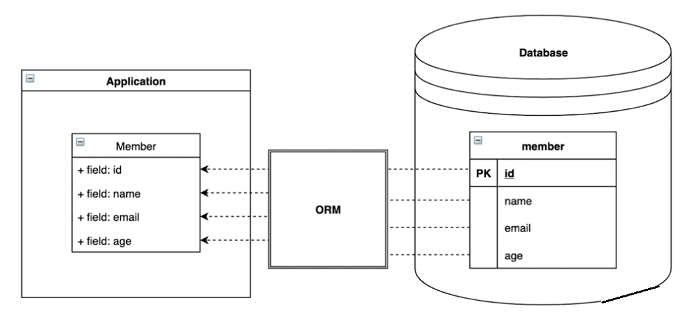
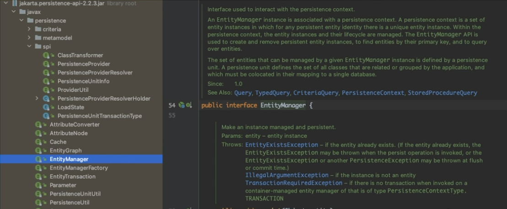
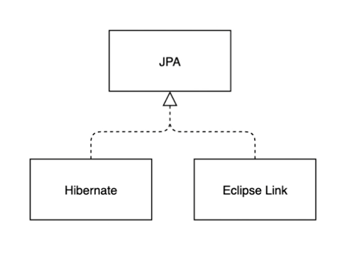
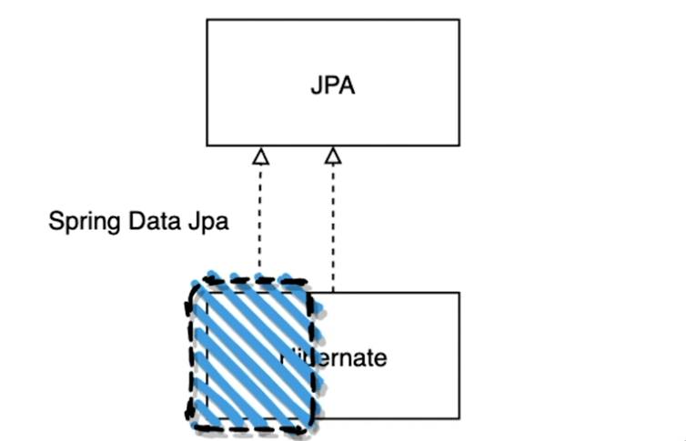
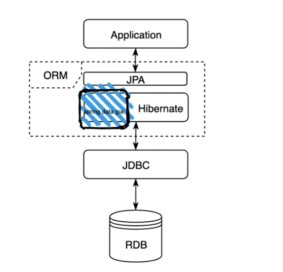

# JPA란 무엇일까?
- Study KeyWord : JPA(Java Persistence Api) , Spring Data JPA, Hibernate, ORM(Object Relational Mapping)
- etc : Lock,Query,Entity,Repository,Relation,RDB,JDBC

 

## ORM (Object Relational Mapping) 이란?

- 데이터를 저장하기 위해 Database를 사용한다.
- 객체 지향 프로그래밍에서 데이터의 기본 단위는 객체(Object)이다.
- Member 객체와 Member 테이블을 연결해주는 것, 즉 객체와 Database를 연결해주는 것을 ORM이라고 한다.
- 만약 ORM 없이 직접 데이터를 핸들링한다면 Select를 해서 받은 결과를 일일이 매핑해서 사용해야 한다.

- JPA(Java Persistence Api)는 ORM 표준으로 정의되어 있다.
- Persistence 영역, 즉 데이터에 접근하기 위한 API 규격을 정의한것이다.
- ORM이 전체적인 개념, JPA는 좀 더 구체적으로 기능을 정의한 스펙으로 볼 수 있다.

 

## 대표적인 예 - Entity

- interface로 구현되어 있으며, 라이브러리의 대부분 클래스는 interface, annotation, enum 이 선언되어 있고 구체 클래스는 거의 
존재하지 않는다.
- JPA 라이브러리의 내부를 살펴보면 데이터에 접근하기 위한 API 규격이다.

- JPA는 Java Persistence Api의 약자이다. 하지만 라이브러리는 jakarta.persistence-api-version 하위에 존재한다.
  - 2019년 이후 Java Persistence Api Jakarta Persistence로 변경하여 사용하기로 했다.
  - 즉 두가지 명칭 모두 동일한 것이다.

 

## Hibernate는 무엇인가?

- Hibernate는 JPA에 대한 실제 구현체에 해당한다.
- Hibernate 외 다른 JPA Provider가 존재하지만 현재 Java에서 사용하는 것은 Hibernate 구현체이다.

- 구현체의 특성상 JPA 규격을 따르는 다른 구현체를 사용할 수 있다.

 

## Spring Data Jpa

- spring에서 hibernate를 좀 더 간편하게 사용할 수 있도록 추상 객체를 한번 더 감싸서 만들어 놓은 것이다.

- Spring Data JPA에서 제공하는 방식을 활용하여 실제로 Entity Manager에 접근하지 않고 데이터에 대한 접근을 좀 더 쉽고 객체지향적으로 처리할 수 있다.

 

## Summary

- ORM : Application과 Database를 연결해주는 것
- JPA : JAVA 의 ORM 표준 스펙 , 인터페이스로 정의하여 제공
- Hibernate : JPA의 실제 구현 클래스의 모음
- Spring Data JPA : hibernate에서 자주 쓰이는 기능을 좀 더 사용하기 쉽도록 묶음으로 제공