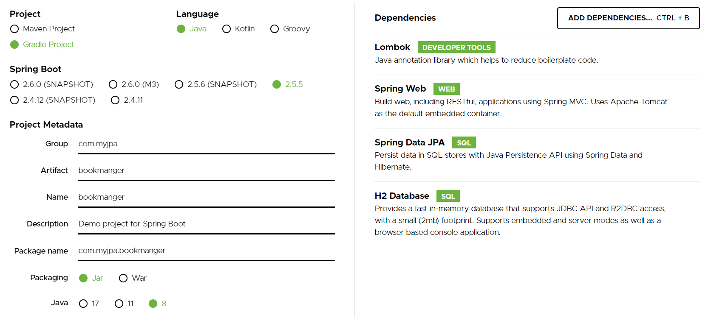
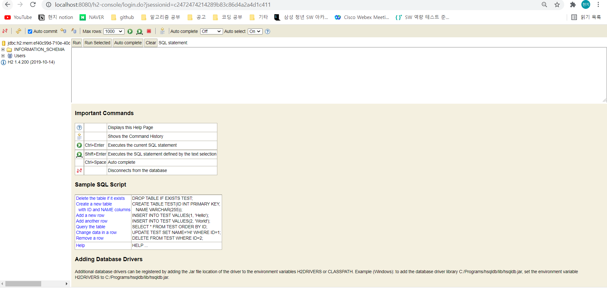

# Project Settings

- JAVA : jdk 1.8 버전
- IDE : IntelliJ Community 버전


- Spring Initializer



<br>

- Dependency (build.gradle)
```gradle
dependencies {
	implementation 'org.springframework.boot:spring-boot-starter-data-jpa'
	implementation 'org.springframework.boot:spring-boot-starter-web'
	compileOnly 'org.projectlombok:lombok'
	runtimeOnly 'com.h2database:h2'
	annotationProcessor 'org.projectlombok:lombok'
	testImplementation 'org.springframework.boot:spring-boot-starter-test'
}
```


<br><br>


# Lombok
- @getter,@setter Annotation을 통해 쉽게 getter,setter 메소드를 만들 수 있따.
- 이렇게 만들어진 메소드는 마우스 오른쪽 클릭 -> Refactor -> Delombok으로 lombok을 사용하지 않은 상태를 확인할 수 있다.
-  lombok dependency를 추가함으로써 컴파일 시 Delombok과정이 일어나고, 이를 통해 우리가 원하는 메소드로 사용할 수 있다.

## Annotation
- @Getter : getter를 만들어주는 Annotation
- @Setter : setter를 만들어주는 Annotation
- @ToString : toString을 Override해주는 Annotation ( 변화가 일어날 때마다 자동 갱신)
- @NoArgsConstructor : 인자가 없는 생성자를 만들어주는 Annotation
- @AllArgsConstructor : 모든 필드를 인자로 받는 생성자를 만들어주는 Annotation
- @RequiredArgsConstructor -꼭 필요한 인자들만 넣어서 만든 생성자를 만들어주는 Anntation(@NonNull 어노테이션이 붙은것, final 필드도 꼭필요한 인자에 해당됨)
  - final 필드나 @NonNull이 붙은 필드가 없으면 NoArgsConstructor와 동일
- @DATA : Equivalent to @Getter @Setter @RequiredArgsConstructor @ToString @EqualsAndHashCode. 이것들을 쓴것과 동일하다.
- @EqualsAndHashCode : @DATA를 사용하면 필요없는 부분, equals() 와 hashcode()를 override해주는 Annotation
- @Builder : @AllArgsConstructor와 비슷하게 객체를 생성하고 필드값을 builder의 형식에 맞게 주입해준다.


### TEST
```java
class UserTest {
    @Test
    void test(){
        
        //@NoArgsCoustructor
        User user=new User();
        user.setEmail("hj@aaa.com");
        user.setName("현지");

        //@AllAgsConstructor
        User user1=new User("현지","hj@aaa.com", LocalDateTime.now(),LocalDateTime.now());
        //@RequireAgsConstructor
        User user2=new User("현지","hj@aaa.com");
        //@Builder
        User user3=User.builder().name("현지").email("hj@aaa.com").build();

        System.out.println(">>> "+user);
    }
}
```

<br><br>


# H2 DB 및 로그 설정
- H2 DB는 Java 기반의 경량화된 관계형 Database이다.
- 파일로 저장해서 실제 DB처럼 유지할 수 있고, 메모리 DB로 사용해서 실제 instance가 동작하는 시점에서 유지하기도 한다.
- Test DB, JUNIT 테스트용 DB로 활용된다.
- Relation,Transaction 처리 등을 위해서는 실제 DBMS (MySql,Oracle 등등)을 활용해서 사용한다.

- main/resource/application.properties 를 application.yaml로 바꾼다.
  - 최근에는 yaml을 사용하는 추세이다.
  - 동작은 거의 유사하나 yaml이 계층적인 형태를 표현하기 효과적이다.
  - 서버 port를 바꾸고 싶다면  yaml에서 간단히 설정가능하다.
    ```
    server:
        port: 8888 // 바꾸고 싶은 포트 번호
    ```
-  h2 DB를 인메모리로 로드하기
  ```
    spring:
        h2:
            console:
                enabled: true
  ```


- Spring Boot Application을 실행시키면 아래와 같은 결과를 얻을 수 있다.

 ```
  H2 console available at '/h2-console'. Database available at 'jdbc url 부분이 여기에 출력된다!'
```
- `http:/localhost:8080/h2-console`로 접속하여 JDBC URL 부분을 console결과와 일치한 주소로 변경해주면 h2 DB에 Connect한 결과를 확인할 수 있다.



- 위처럼 Web Console로 확인할 수 있고, IntelliJ에서 직접 확인할 수도 있다.
- 오른쪽 gradle 탭 있는 부분에 Database 탭이 존재하며, +버튼을 눌러 DataSurce를 보면 우리가 사용할 H2 DB가 있다.
- H2 DB에 들어가서 다운로드 후 JDBC URL을 지정해준 후 type을 In-Memory로 설정하여 사용할 수 있다.
- 단, Community 버전은 지원하지 않는다.